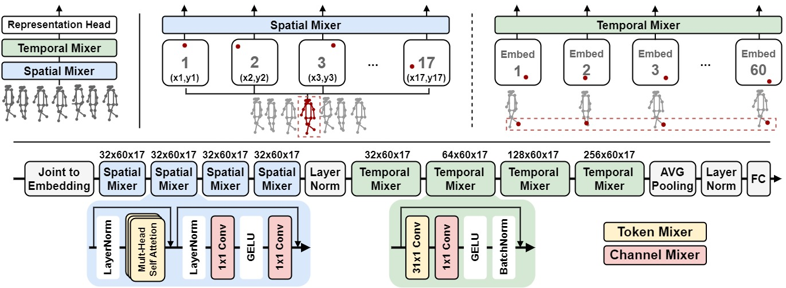

# GaitMixer
This repository contains the PyTorch code for:

__GaitMixer: Skeleton-based Gait Representation Learning via Wide-spectrum Multi-axial Mixer__

[Ekkasit Pinyoanuntapong](https://github.com/exitudio), Ayman Ali, Pu Wang, Minwoo Lee, Chen Chen

<!-- [](https://doi.org/10.1109/ICIP42928.2021.9506717) [](https://arxiv.org/abs/2101.11228) [](#CitingGaitGraph) [](https://paperswithcode.com/sota/multiview-gait-recognition-on-casia-b?p=gaitgraph-graph-convolutional-network-for) -->



## Quick Start

First, create a virtual environment or install dependencies directly with:
```shell
conda env create -f environment.yml
```

### Data preparation
Follow [GaitGraph data preparation](https://github.com/tteepe/GaitGraph#data-preparation)

### Train
To train the model you can run the `train.py` script. Our paper presents 2 models to study behavior of self-attetion and large kernel depthwise separable convolution
1. ***GaitMixer*** (Spatial self-attention & temporal convolution)
```shell
python train.py casia-b ../data/casia-b_pose_train_valid.csv --valid_data_path ../data/casia-b_pose_test.csv
```
2. ***GaitFormer*** (Spatial-temporal self-attention)
```shell
python train.py casia-b ../data/casia-b_pose_train_valid.csv --valid_data_path ../data/casia-b_pose_test.csv --model_type spatiotemporal_transformer
```

Check `experiments/*.sh` to see the example of other configurations used in the paper. 
By default, testing runs every 10 epochs. Use ```--test_epoch_interval 1``` to change number of epochs per testing .
See more training options in [training doc](./docs/train.md)


## Main Results
Top-1 Accuracy per probe angle excluding identical-view cases for the provided models on 
[CASIA-B](http://www.cbsr.ia.ac.cn/english/Gait%20Databases.asp) dataset.

|        |    0 |   18 |   36 |   54 |   72 |   90 |   108 |   126 |   144 |   162 |   180 |   mean |
|:-------|-----:|-----:|-----:|-----:|-----:|-----:|------:|------:|------:|------:|------:|-------:|
| NM#5-6 | 94.4 | 94.9 | 94.6 | 96.3 | 95.3 | 96.3 | 95.3  | 94.7  |  95.3 |  94.7 |  92.2 |   94.9 |
| BG#1-2 | 83.5 | 85.6 | 88.1 | 89.7 | 85.2 | 87.4 | 84.0  | 84.7  |  84.6 |  87.0 |  81.4 |   85.6 |
| CL#1-2 | 81.2 | 83.6 | 82.3 | 83.5 | 84.5 | 84.8 | 86.9  | 88.9  |  87.0 |  85.7 |  81.6 |   84.5 |

The pre-trained model is available [here](https://github.com/tteepe/GaitGraph/releases/tag/v0.1).

## Licence & Acknowledgement
GaitMixer itself is released under the MIT License (see LICENSE).

The following parts of the code are borrowed from other projects. Thanks for their wonderful work!
- GaitGraph: [tteepe/GaitGraph](https://github.com/tteepe/GaitGraph)
- PoseFormer: [zczcwh/PoseFormer](https://github.com/zczcwh/PoseFormer)

<!-- ## <a name="CitingGaitGraph"></a>Citing GaitGraph
If you use GaitGraph, please use the following BibTeX entry.

```
@inproceedings{teepe2021gaitgraph,
  author={Teepe, Torben and Khan, Ali and Gilg, Johannes and Herzog, Fabian and H\"ormann, Stefan and Rigoll, Gerhard},
  booktitle={2021 IEEE International Conference on Image Processing (ICIP)}, 
  title={Gait{G}raph: Graph Convolutional Network for Skeleton-Based Gait Recognition}, 
  year={2021},
  pages={2314-2318},
  doi={10.1109/ICIP42928.2021.9506717}
} -->
```
